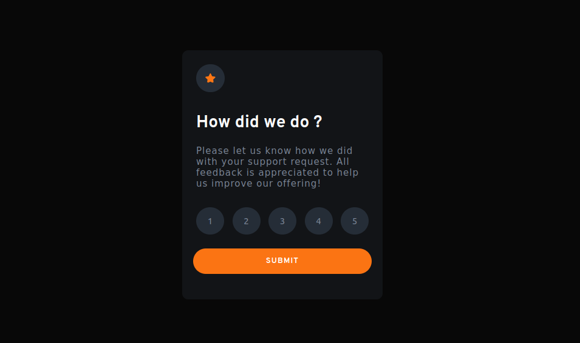
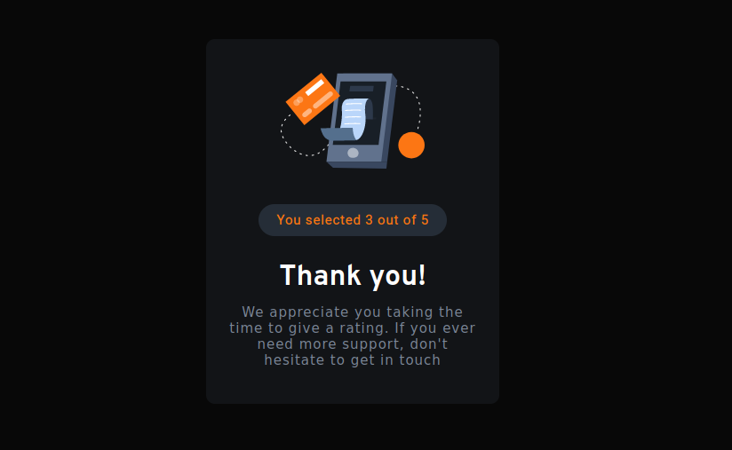

# Frontend Mentor - Interactive rating component solution

This is a solution to the [Interactive rating component challenge on Frontend Mentor](https://www.frontendmentor.io/challenges/interactive-rating-component-koxpeBUmI). Frontend Mentor challenges help you improve your coding skills by building realistic projects. 

### The challenge

Users should be able to:

- View the optimal layout for the app depending on their device's screen size
- See hover states for all interactive elements on the page
- Select and submit a number rating
- See the "Thank you" card state after submitting a rating

### Screenshot

### Links

- Github Page URL: [Interactive rating component](https://amoryne.github.io/Interactive-rating-component/)

### Built with

- Semantic HTML5 markup
- CSS/SCSS custom properties
- Flexbox
- Mobile-first workflow
- Javascript
- Dom manipulation

## Author

- Frontend Mentor - [Amo Jlt](https://www.frontendmentor.io/profile/Amoryne)

## Acknowledgments

My Becode friends.
